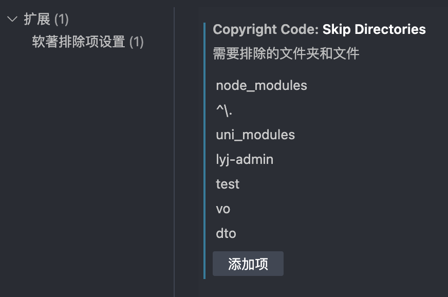

<div align="center">
<!-- Logo -->

<!-- 名称 -->
<h1>Copyright-Code</h1>
</div>

这是一个VSCode插件，用于快速提取**去除了注释和空行**的项目代码，并输出到一个txt文件中。

是的，它最大的作用就是申请软著，~~也可以用来看有效代码行数~~

前往插件市场下载：[https://marketplace.visualstudio.com/items?itemName=qcqx.copyright-code](https://marketplace.visualstudio.com/items?itemName=qcqx.copyright-code)

## 使用方法
使用它也很简单，就一个命令：`Extract Code`，你可以在命令面板（`Ctrl+Shift+P`）中搜索到它。

> 还有一个功能相同的中文命令：`软著代码生成`

然后你可以在弹出的面板中选择:
1. 想要提取的**文件后缀**
2. 需要**排除**的**文件夹(目录)**
3. 需要**排除**的**根目录文件**

最后，它会在你的项目根目录下生成一个`extractedCode.txt`文件，里面就是提取好的**无注释、无空行、连续的**代码。

## 额外的东西tips
如果你的工作区中有多个根文件夹，最开始还会让你**选择其中一个**进行后续操作。

在选择需排除的文件夹和根目录文件时，插件已经自动排除了**不包含**你选择的文件后缀的目录、文件，这些目录、文件**不会**出现在选择面板中。

例如你选择了vue、ts后缀，则不包含这两种文件的目录、文件都已默认排除，不会出现在你的选择面板中。

通过对文件后缀的选择、排除的文件夹和根目录文件的选择，已经可以非常灵活地提取代码了。**全选后再反选**，就是选择需要的文件夹和根目录文件。

一些文件和文件夹会默认排除，不会出现在选择面板中。如：`package.json`、`node_modules`、`uni_modules`和`.`开头的文件夹

```js 内置默认排除
// 内置的需要排除的文件，不会出现在选择面板中
const excludeFiles = [outPutFileName, 'package.json', 'package-lock.json', 'pnpm-lock.yaml', 'yarn.lock'];
// 内置的需要排除的文件夹，不会出现在选择面板中
const skipDirectories = ['node_modules', /^\./, 'uni_modules'];
```

当然，你也可以直接在插件的设置项中添加需要排除的文件夹


> 祝软著申请顺利，当然这多半是一两个月后的消息了。

## 贡献

图标设计：[张洪Heo](https://github.com/zhheo)


